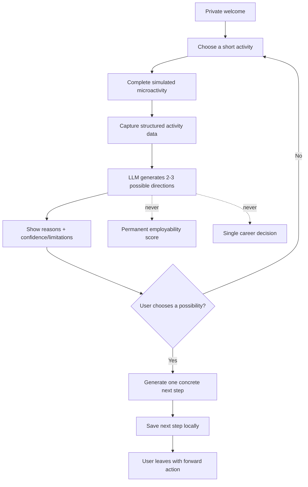
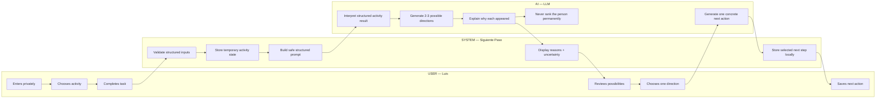

# PACKET — WEEK 4
## Siguiente Paso

**Author:** Diego Gil  
**Role lens:** USER  
**Primary vacuum:** Nini Re-entry  
**Week:** 4 — When the Tutor Knows Your Child Better Than You Do

---

## 1. Problem in my words

A young Mexican who is outside both school and formal work does not necessarily need another course, another AI tutor, or another lecture about what went wrong. The first barrier is re-entry itself.

Many re-entry systems begin by asking the user to explain their past: why they left school, why they stopped working, what failed, or what support they need. For the exact user in this project, that can create shame and friction before any useful action happens.

**Siguiente Paso** begins with a forward action instead. The user privately completes one short simulated activity, sees a few transparent possibilities connected to what they just demonstrated, chooses one, and leaves with one concrete next step.

The product does **not** define the person as a "nini," does **not** ask them to confess failure, and does **not** let AI decide their future.

---

## 2. Exact user

**Luis, 20, Estado de México.**

Luis is currently outside school and formal work. He uses WhatsApp daily, has a smartphone, and has done informal tasks helping in a family business, but he does not have a strong professional network or a clear résumé.

He does not want:
- another long course before anything useful happens;
- to explain why he left school or work;
- to be labeled publicly as someone receiving assistance;
- an AI system that tells him what career he "should" have;
- another government-looking application full of personal questions.

He does want:
- a private first interaction;
- something practical he can complete in a few minutes;
- simple Spanish;
- visible reasons behind any AI suggestion;
- one concrete next action he can take immediately.

---

## 3. Success definition

**Before the module closes, a user can complete one end-to-end simulated re-entry flow at the live URL and leave with one concrete next step without explaining why they left school or work.**

The slice succeeds when Luis can:

1. Enter privately without identifying himself as a "nini."
2. Choose one short simulated activity.
3. Complete the activity using only structured inputs.
4. See what the activity demonstrated in plain Spanish.
5. Receive 2–3 possible directions generated from structured data.
6. See confidence/limitations and why each possibility appeared.
7. Choose one possibility.
8. Receive one concrete next action that can be done within 24–48 hours.
9. Save that next step locally for the demo.
10. Never be given a permanent employability score or a single AI-decided career.

### Acceptance sentence

> Before the module closes, Luis can move from a private first interaction to one concrete forward action without being asked to explain his past and without AI deciding his future.

---

## 4. Image-generated mockup

The image-generated concept mockup is saved as:

`docs/assets/MOCKUP_SiguientePaso_Week4.png`

The mockup establishes five key screens:

1. **Private entry:** “Empieza por lo que puedes hacer hoy.”
2. **Activity choice:** Organizar / Resolver / Planear.
3. **Simulated microactivity:** short structured task.
4. **Transparent possibilities:** 2–3 directions with reasons and uncertainty.
5. **Concrete next step:** one action the user can save and complete.

---

## 5A. Flowchart — Mermaid



---

## 5B. Swimlane — Mermaid



---

## 6. Benchmark line — GLOBAL → LOCAL

**Best existing solution on Earth:** Generation is one of the strongest existing attempts because it connects people who are unemployed or underemployed to training and employment pathways, measuring success through real employment outcomes rather than content consumption alone.

**Mine differs/localizes by:** Siguiente Paso starts earlier and smaller: a private, no-confession first interaction for a Mexican re-entry user, using one short action to create transparent possibilities and one concrete next step without requiring enrollment in a program first.

### Additional benchmark lessons

**Year Up United** demonstrates that skills development is more valuable when it connects directly to opportunity and work experience.

**Europass** demonstrates that useful capability can be represented beyond a single formal credential and can include experiences acquired across different contexts.

### Translation question

These models do not automatically solve the Mexican re-entry problem. A local user may have informal work experience, an incomplete educational history, limited professional networks, older devices, inconsistent connectivity, and distrust of formal institutions.

The Mexican version therefore must:
- be Spanish-first and mobile-first;
- avoid requiring a résumé at entry;
- recognize that informal experience can still indicate capability;
- avoid looking like another government assistance form;
- create value before asking for commitment;
- keep AI suggestions visibly uncertain and non-binding.

---

## 7. Long-view paragraph — 3 years

In three years, **Siguiente Paso** could become a trusted re-entry layer connecting young people in Mexico to employers, NGOs, municipalities, and training providers without forcing them into a single institutional program. A user could build a private record of completed actions and demonstrated capabilities while receiving transparent, updated possibilities tied to real local opportunities. The product would become infrastructure for dignified re-entry: helping people move from inactivity to proof, opportunity, income, or further learning without turning their past into a permanent label.

---

## 8. Scope cut — what I am NOT building

For this week's working slice:

- I am **not** building an AI tutor that explains school subjects.
- I am **not** building a full course platform.
- I am **not** guaranteeing job placement.
- I am **not** building an employer dashboard.
- I am **not** collecting a real résumé.
- I am **not** asking why the user left school or work.
- I am **not** collecting sensitive personal history.
- I am **not** building a government-benefits application.
- I am **not** creating a permanent employability score.
- I am **not** hiding career paths based on AI recommendations.
- I am **not** using real skill certification in the demo.
- Skill/activity interpretation may be simulated or LLM-assisted and must be labeled appropriately.
- I am **not** storing personal data in a remote database for this slice.

The slice is only:

> **private entry → short activity → structured data → transparent possibilities → user choice → one concrete next step**

---

## 9. Blueprint conditions honored

### Condition 1 — First contact must be private

The user is never shown publicly as someone receiving assistance. The demo requires no public profile and no social/group entry.

### Condition 2 — No confession required

The product never asks: “Why did you leave school?” or “Why are you unemployed?” The user starts with a forward action.

### Condition 3 — Must not resemble another government assistance program

The interface avoids institutional-benefit language, caseworker framing, eligibility questions, and application-style onboarding.

### Condition 4 — Family does not pay

The user-facing slice is free. The long-term payer hypothesis remains employers, NGOs, or redirected public funding tied to outcomes, but this business model is not proven in the prototype.

### Condition 5 — AI recommendations show confidence and recency

Every generated possibility must display:
- why it appeared;
- what structured evidence supported it;
- a visible confidence/limitation statement;
- that it is a possibility, not a decision.

For this prototype, confidence is a transparent demo indicator tied to the structured activity, not a claim of true career fit.

### Condition 6 — SHADOW CLAUSE

> **Re-entry must be actionable without the user ever declaring that their first path failed. The first interaction is a forward action, not a confession.**

Additional implementation rule:

> **AI may suggest possibilities, but it may not create a permanent score, hide alternatives, or decide the user's future.**

---

## 10. Architecture + stack

| Layer | Technology / Service | Purpose |
|---|---|---|
| Frontend | Next.js + TypeScript | Spanish-first, mobile-first re-entry flow |
| Styling | Tailwind CSS / CSS | Clear cards, warnings, responsive layout |
| Structured data | TypeScript schemas + validated JSON | Activity answers, result signals, selected direction |
| LLM | OpenAI API | Generate constrained possibilities, reasons, and next action |
| Backend | Next.js Route Handlers | Validate input, call LLM, enforce schema/fallback |
| Local state | React state + localStorage | Preserve invented demo activity and next step |
| Database | None for Week 4 slice | Avoid storing personal data |
| Auth | None for Week 4 slice | Not triggered because no personal data is stored remotely |
| Deployment | Vercel | Live URL and server-side environment variable |
| Version control | Git + GitHub | Commit history |
| Testing | Vitest + React Testing Library + manual tests | Mechanical and Persona Test evidence |

### Security Floor decisions

1. **No secrets in repo.** `OPENAI_API_KEY` exists only in local/Vercel environment variables.
2. **No real personal data.** Demo activity inputs are invented/structured and clearly labeled.
3. **No remote personal-data storage.** Therefore Google Auth/RLS are not triggered in this slice.
4. **Every input is validated.** Only allowlisted activities and answers are accepted.
5. **LLM input is structured.** No unrestricted biography or sensitive personal history is sent to the model.
6. **LLM output is validated.** The model cannot return a permanent employability score or a single mandatory trajectory.
7. **Safe fallback.** If the LLM fails, deterministic demo possibilities keep the experience working.

---

## 11. Core structured data model

```ts
type ActivityType = "organize" | "solve" | "plan";

type ActivityResult = {
  activity: ActivityType;
  simulated: true;
  answers: string[];
  demonstratedSignals: string[];
};

type DirectionPossibility = {
  id: string;
  title: string;
  reason: string;
  confidenceLabel: "low" | "medium" | "demo";
  limitations: string;
};

type NextStep = {
  directionId: string;
  title: string;
  description: string;
  estimatedMinutes: number;
  timeHorizon: "today" | "24-48-hours";
  simulated: true;
};
```

No field stores:
- `employabilityScore`
- `futurePotentialScore`
- `recommendedCareer`
- `failureReason`
- `whyUserLeftSchool`
- sensitive personal history.

---

## 12. Product rules

1. Do not use the word “nini” to label the user in the interface.
2. Never ask why the user left school or work.
3. First meaningful interaction must be an action, not a questionnaire about the past.
4. Activities must take less than five minutes in the demo.
5. AI suggestions are possibilities, not decisions.
6. Show why every possibility appeared.
7. Show uncertainty/limitations visibly.
8. Never generate a permanent person-level score.
9. Always show at least two possibilities when a result is available.
10. The user chooses what to explore.
11. Every selected possibility produces one concrete next step.
12. Success is leaving with a forward action, not enrollment.
13. No payment is requested from the user or family.
14. No real personal data is required.

---

## 13. Test plan

| ID | Test | What it checks | Expected result |
|---|---|---|---|
| T1 | Start flow | Private entry | User starts without personal-history questions |
| T2 | Activity selection | Choice | User can choose Organizar / Resolver / Planear |
| T3 | Invalid activity payload | Validation | Route rejects non-allowlisted values |
| T4 | Complete microactivity | Structured data | Valid structured result created |
| T5 | LLM possibilities | Stack floor | 2–3 structured directions returned |
| T6 | Explainability | Blueprint condition | Each possibility shows reason + limitation |
| T7 | No permanent score | Shadow safety | No employability/person score exists |
| T8 | Choose direction | User control | User selects; AI does not auto-select |
| T9 | Concrete next step | Outcome | One actionable next step is generated |
| T10 | Local save | Demo continuity | Selected next step survives refresh if implemented |
| T11 | LLM failure | Safe fallback | Deterministic fallback; flow still works |
| T12 | Security scan | Security Floor | No secrets or real personal data in repo |
| T13 | Forbidden-zone scan | Scope | No subject-explainer/tutoring feature |
| T14 | Mechanical pass | Required testing | At least one genuine bug found, fixed, retested, redeployed |
| T15 | Persona Test | User comprehension | Confusions logged; worst confusion fixed and redeployed |
| T16 | Mobile layout | Mexico-first usability | Core flow works at phone width |

---

## 14. Persona-test seed

> **You are Luis, 20, from Estado de México. You are currently not studying and do not have a formal job. You use WhatsApp every day and are comfortable with basic phone apps, but you distrust programs that ask too many personal questions. You have helped informally in a family business, but you do not think of that as professional experience. You become uncomfortable when a product asks why you left school or implies that you failed. You read the largest text first, want a useful result quickly, and may silently quit if the app feels like government aid, a school lecture, or a judgment about your future. I will show you screenshots one at a time. For each screen, tell me what you think it asks you to do, exactly what you would click or type, what makes you hesitate, and whether you would abandon. Do not act like a UX expert.**

---

## 15. Mechanical test / fix evidence plan

The mechanical pass must produce a real cycle:

1. Deploy a working slice.
2. Execute T1–T13.
3. Find at least one genuine reproducible bug.
4. Record:
   - reproduction steps;
   - expected behavior;
   - actual behavior;
   - severity;
   - why it matters to Luis.
5. Fix only that issue.
6. Add a regression test.
7. Run lint, typecheck, tests, build, and `git diff --check`.
8. Commit the fix.
9. Push.
10. Confirm a new Vercel deployment.
11. Re-run the failed scenario.
12. Document the result in `docs/DECISIONS.md`.

---

## 16. Commit and deployment plan

Planned meaningful commits:

1. `docs: create Week 4 packet and implementation plan`
2. `feat: establish private forward-action reentry flow`
3. `feat: add structured simulated microactivity`
4. `feat: add constrained AI direction possibilities`
5. `feat: add concrete next-step selection and local save`
6. `fix: address mechanical test finding`
7. `fix: address persona test confusion`

Deployment checkpoints:

- **Deploy #1:** after the core activity + possibilities flow works.
- **Deploy #2:** after the mechanical bug fix.
- **Final deploy:** after the Persona Test correction.

---

## 17. Definition of done

Week 4 is done only when:

- `docs/PACKET.md` exists before feature code.
- The image-generated mockup is stored under `docs/assets/`.
- The build attacks Nini Re-entry.
- The build does not become an AI subject tutor.
- All six Blueprint conditions are honored.
- The Shadow Clause is visible in product behavior.
- LLM + structured data are implemented.
- There are at least 5 meaningful commits.
- There are at least 2 deployments.
- The live URL works.
- The mechanical pass finds and fixes a real bug.
- The Persona Test is documented and its worst confusion is fixed.
- `docs/DECISIONS.md` records major decisions.
- The final submission contains:
  - Live URL
  - GitHub link
  - `DEMO_DiegoGil.mp4`
  - `PACKET_DiegoGil.pdf`
  - `PERSONA_DiegoGil.pdf`
  - `BUILDCHAT_DiegoGil.pdf`

---

# Session Close — Packet phase

### Decisions made

- Product: **Siguiente Paso**
- Primary vacuum: **Nini Re-entry**
- Exact user: **Luis, 20, Estado de México**
- First interaction: private forward action, never a confession
- Stack: Next.js + TypeScript + structured data + server-side LLM
- AI role: generate possibilities and explanations, never decide the user's future
- Storage: local demo state only; no remote personal data
- Shadow Clause: re-entry must be possible without declaring prior failure
- Success: user leaves with one concrete next action

### Next first move

Turn this packet into a precise coding-agent implementation prompt with small testable milestones, acceptance criteria, at least five meaningful commits, and the first deployment checkpoint.
